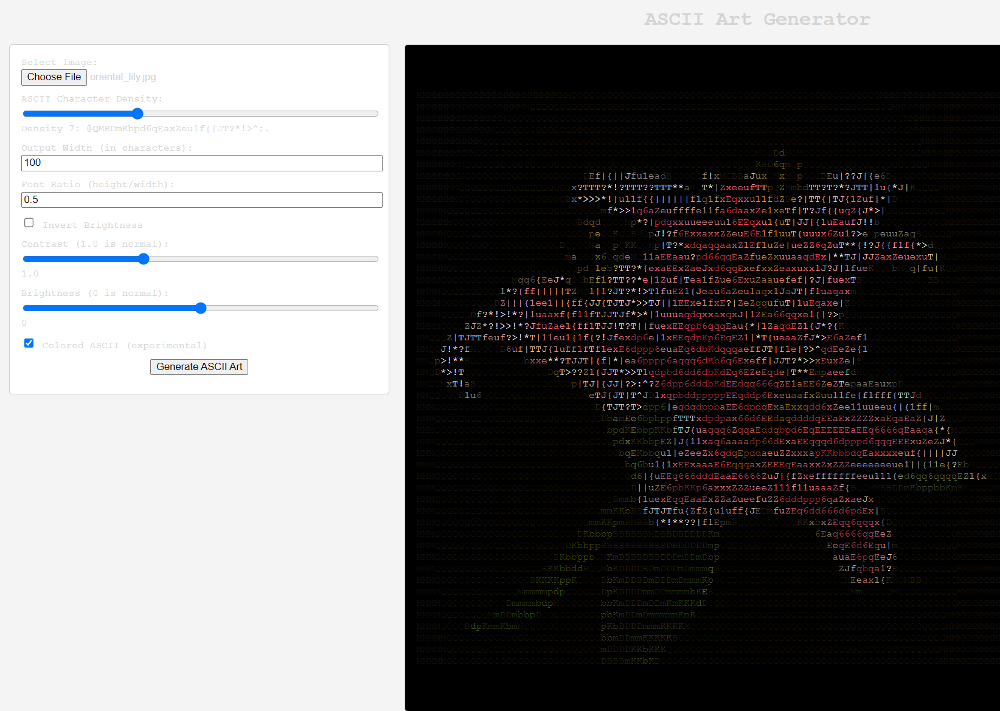

# ASCII Art Generator

A web-based tool that converts images to ASCII art with real-time parameter adjustments.

## Features
- Image upload support (PNG, JPG, GIF)
- Adjustable output width (character count)
- Real-time parameter tuning:
  - Character density
  - Font aspect ratio
  - Brightness/contrast
  - Color output (experimental)
- Instant preview while adjusting settings

## Usage
1. Open `ascii_generator.html` in a modern browser
2. Select an image file
3. Adjust parameters:
   - **Output Width**: Controls resolution (50-200+ characters)
   - **Density**: Character variety (1-20)
   - **Font Ratio**: Adjust for font aspect ratio (0.3-2.0)
   - **Brightness/Contrast**: Fine-tune output visibility
   - **Invert**: Swap dark/light values
4. Click "Generate ASCII Art"
5. Copy/paste or screenshot the result

## Technical Notes
- Image processing done via HTML5 Canvas
- ASCII mapping uses luminance values (ITU-R BT.709 formula)
- Dynamic density scaling preserves character progression
- Color output maintains original RGB values per character

## Customization
Modify these parameters in the interface:
- `output-width`: Width in characters (50-300)
- `font-ratio`: Height/width ratio (0.3-2.0)
- `ascii-density`: Character set complexity (1-20)
- `contrast`: 0-3.0 (default 1.0)
- `brightness`: -100 to +100 (default 0)